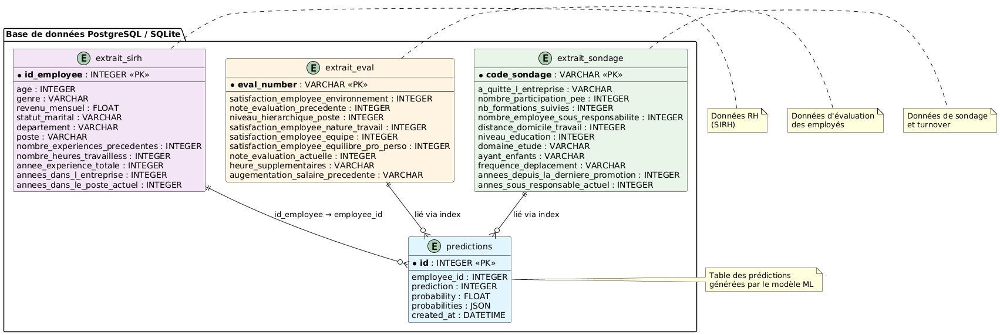

# API de Prédiction de Turnover

![Python][FastApi-url]![Github][GitHub-Actions]![Postgres][Postgres]![Docker][Docker]![Pytest][Pytest]![Swagger][Swagger]

API REST développée avec FastAPI pour prédire le risque de départ des employés d'une entreprise. Le modèle de machine learning analyse divers facteurs (satisfaction, salaire, expérience, etc.) pour identifier les employés à risque de quitter l'entreprise

## Sommaire

- [Fonctionnalités](#fonctionnalités)
- [Prérequis](#prérequis)
- [Installation](#installation)
- [Documentation](#documentation)
- [Configuration](#configuration)
- [Lancement de l'application](#lancement-de-lapplication)
- [Endpoints de l'API](#endpoints-de-lapi)
- [Tests](#tests)
- [CI/CD](#cicd)
- [Déploiement](#déploiement)

## Fonctionnalités

- Prédiction du risque de départ pour un employé individuel
- Prédiction en masse pour tous les employés en base de données
- Calcul du niveau de risque (HIGH/LOW) et des probabilités
- Stockage des prédictions dans PostgreSQL
- API REST documentée avec Swagger
- Tests automatisés avec couverture de code > 75%
- CI/CD avec GitHub Actions
- Déploiement automatique sur Hugging Face Spaces

## Prérequis

- Python 3.12
- PostgreSQL 14+
- Docker & Docker Compose
- Git

## Installation

### Installation locale

1. **Cloner le repository**

```bash
git clone https://github.com/votre-username/Oc_p5_deploy.git
cd Oc_p5_deploy
```

2. **Créer un environnement virtuel**

```bash
python -m venv env
source env/bin/activate  # Sur Windows: env\Scripts\activate
```

3. **Installer les dépendances**

```bash
pip install -r requirements.txt
```

### Installation avec Docker

```bash
docker-compose up -d
```

## Documentation

### Documentation technique complète

Une documentation technique détaillée est disponible au format HTML avec Sphinx.

**Pour y accéder** :

1. Ouvrez le fichier `docs/build/index.html` dans votre navigateur

Ou

2. Lancez un serveur web :
   ```bash
   cd docs/build
   python -m http.server 8080
   ```
   Puis ouvrez http://localhost:8080

**Contenu de la documentation** :

- **Introduction** : Contexte, objectifs et modèle ML
- **Installation** : Guide d'installation détaillé avec résolution de problèmes
- **Référence API** : Documentation complète de tous les endpoints
  - Descriptions détaillées
  - Paramètres et schémas de données
  - Exemples avec cURL, Python, JavaScript
  - Codes d'erreur et gestion
  - Format EmployeeInput avec 30+ champs

## Configuration

### Variables d'environnement

Créez un fichier `.env` à la racine du projet :

```env
# PostgreSQL
POSTGRES_USER=votre_user
POSTGRES_PASSWORD=votre_password
DB_HOST=localhost
DB_PORT=5432
DB_NAME=turnover_db

# PgAdmin
PGADMIN_DEFAULT_EMAIL=admin@example.com
PGADMIN_DEFAULT_PASSWORD=admin
```

### Initialisation de la base de données

```bash
python data/create_db.py
```

Cette commande va :

- Créer les tables nécessaires
- Charger les données depuis les fichiers CSV (`extrait_sirh.csv`, `extrait_eval.csv`, `extrait_sondage.csv`)

## Lancement de l'application

### Mode développement (local)

```bash
uvicorn app.main:app --reload --host 0.0.0.0 --port 8000
```

L'API sera accessible sur : `http://localhost:8000`

### Avec Docker

```bash
docker-compose up
```

Services disponibles :

- API : `http://localhost:8000`
- PgAdmin : `http://localhost:5050`
- PostgreSQL : `localhost:5432`

### Documentation interactive

Une fois l'application lancée, accédez à la documentation Swagger :

- Swagger UI : `http://localhost:8000/docs`
- ReDoc : `http://localhost:8000/redoc`

## Endpoints de l'API

> 📖 **Documentation technique complète** : Pour une documentation détaillée de tous les endpoints avec exemples complets (cURL, Python, JavaScript), consultez la [documentation technique](docs/build/index.html) (ouvrir dans votre navigateur).

### Root

```
GET /
```

Retourne les informations de l'API et la liste des endpoints disponibles.

**Réponse :**

```json
{
  "message": "API de prédiction de turnover",
  "version": "1.0.0",
  "endpoints": {
    "predict": "POST /predict - Prédire le turnover pour tous les employés en BDD",
    "predict_one": "POST /predict_one - Prédire le turnover pour un employé via input",
    "predictions": "GET /predictions - Récupérer toutes les prédictions",
    "prediction_by_id": "GET /predictions/{id}",
    "delete_prediction": "DELETE /predictions/{id}",
    "health": "GET /health"
  }
}
```

### Health Check

```
GET /health
```

Vérifie l'état de santé de l'API.

**Réponse :**

```json
{
  "status": "healthy",
  "model_loaded": true,
  "database_url_configured": true
}
```

### Prédiction individuelle

```
POST /predict_one
```

Prédit le risque de départ pour un employé spécifique.

**Corps de la requête :**

```json
{
  "employee_id": 123,
  "age": 35,
  "revenu_mensuel": 5000.0,
  "annees_dans_l_entreprise": 5,
  "satisfaction_employee_nature_travail": 3,
  "satisfaction_employee_equilibre_pro_perso": 3
}
```

**Réponse :**

```json
{
  "success": true,
  "prediction_id": 42,
  "prediction": {
    "will_leave": false,
    "probability": 0.234,
    "risk_level": "LOW"
  }
}
```

### Prédiction en masse

```
POST /predict
```

Prédit le risque de départ pour tous les employés en base de données.

**Réponse :**

```json
{
  "success": true,
  "total_employees": 150,
  "statistics": {
    "high_risk": 45,
    "low_risk": 105,
    "high_risk_percentage": 30.0
  },
  "predictions": [
    {
      "employee_id": 1,
      "employee_index": 0,
      "will_leave": true,
      "probability": 0.678,
      "risk_level": "HIGH"
    }
    // ...
  ]
}
```

### Liste des prédictions

```
GET /predictions?skip=0&limit=100
```

Récupère toutes les prédictions enregistrées avec pagination.

**Paramètres :**

- `skip` : Nombre d'éléments à sauter (défaut: 0)
- `limit` : Nombre maximum d'éléments à retourner (défaut: 100)

**Réponse :**

```json
{
  "success": true,
  "total": 250,
  "skip": 0,
  "limit": 100,
  "predictions": [
    {
      "id": 1,
      "employee_id": 123,
      "prediction": 1,
      "probability": 0.678,
      "probabilities": [0.322, 0.678],
      "created_at": "2025-01-12T10:30:00"
    }
  ]
}
```

### Détail d'une prédiction

```
GET /predictions/{prediction_id}
```

Récupère une prédiction spécifique par son ID.

### Suppression d'une prédiction

```
DELETE /predictions/{prediction_id}
```

Supprime une prédiction de la base de données.

**Réponse :**

```json
{
  "success": true,
  "message": "Prédiction 42 supprimée avec succès"
}
```

## Tests

### Lancer les tests

```bash
# Tests simples
pytest tests/ -v

# Tests avec couverture
pytest tests/ -v --cov=app --cov-report=html

# Voir le rapport de couverture
open htmlcov/index.html
```

### Couverture de code

Le projet maintient une couverture de code supérieure à 75%. La pipeline CI/CD échouera si la couverture descend en dessous de ce seuil.

## CI/CD

### GitHub Actions

La pipeline CI/CD est déclenchée à chaque push sur la branche `main` :

1. **Tests** :

   - Installation des dépendances
   - Création de la base de données de test
   - Exécution des tests avec pytest
   - Vérification de la couverture de code (≥ 75%)
   - Upload du rapport de couverture en artifact

2. **Déploiement** :
   - Si les tests passent, déploiement automatique sur Hugging Face Spaces

### Configuration des secrets GitHub

Dans Settings → Secrets and variables → Actions, ajoutez :

```
POSTGRES_USER=test_user
POSTGRES_PASSWORD=test_password
DB_HOST=localhost
DB_PORT=5432
DB_NAME=test_db
HF_TOKEN=votre_token_hugging_face
```

## Déploiement

### Hugging Face Spaces

L'application est automatiquement déployée sur Hugging Face Spaces via Docker.

**URL de déploiement :** `https://huggingface.co/spaces/christophe-ringot/Oc_P5`

Le déploiement utilise SQLite au lieu de PostgreSQL pour simplifier l'hébergement.

### Utilisation de l'API hébergée sur Hugging Face

Une fois l'application déployée sur Hugging Face Spaces, vous pouvez l'utiliser de plusieurs façons :

#### 1. Documentation Swagger Interactive

Accédez à la documentation interactive à l'URL :

```
https://christophe-ringot-oc-p5.hf.space/docs
```

Vous pouvez tester directement tous les endpoints depuis l'interface Swagger.

#### Notes importantes pour l'utilisation en production

**Limitations de Hugging Face Spaces :**

- L'espace peut se mettre en veille après une période d'inactivité
- Le premier appel après une période d'inactivité peut prendre 30-60 secondes (temps de démarrage)
- Les données sont stockées dans SQLite (pas de persistance garantie en cas de redémarrage)

## Structure du projet

```
.
├── app/
│   ├── __init__.py
│   ├── main.py
│   ├── models.py
│   ├── database.py
│   ├── model/
│   │   └── full_pipeline.joblib
│   └── utils/
│       └── preprocessing.py
├── data/
│   ├── create_db.py
│   ├── extrait_sirh.csv
│   ├── extrait_eval.csv
│   └── extrait_sondage.csv
├── tests/
│   ├── conftest.py
│   ├── test_api.py
│   ├── test_preprocessing.py
│   └── ...
├── .github/
│   └── workflows/
│       └── ci.yml
├── Dockerfile
├── docker-compose.yml
├── requirements.txt
└── README.md
```

## Diagramme de la base de données



[FastApi-url]: https://img.shields.io/badge/FastAPI-005571?style=for-the-badge&logo=fastapi
[GitHub-Actions]: https://img.shields.io/badge/github%20actions-%232671E5.svg?style=for-the-badge&logo=githubactions&logoColor=white
[Postgres]: https://img.shields.io/badge/postgres-%23316192.svg?style=for-the-badge&logo=postgresql&logoColor=white
[Docker]: https://img.shields.io/badge/docker-%230db7ed.svg?style=for-the-badge&logo=docker&logoColor=white
[Pytest]: https://img.shields.io/badge/pytest-%23ffffff.svg?style=for-the-badge&logo=pytest&logoColor=2f9fe3
[Swagger]: https://img.shields.io/badge/-Swagger-%23Clojure?style=for-the-badge&logo=swagger&logoColor=white
